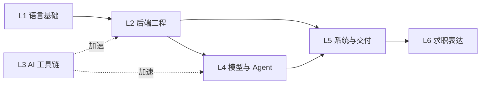

# 0.2 能力模型与 180 天学习路线

## 本章导读

上一章画了岗位地图，这一章把它变成可执行的计划。
先给你一张**能力自评表**（六个层级，每层都有「不合格 / 合格 / 优秀」的具体表现），
再给出一条**有依赖关系的 180 天路线**和一条**在职者的 90 天压缩路线**。
最后说明为什么全书只用一个项目，以及每个阶段用什么**可验证的产物**验收。

## 学习目标

- [ ] 用「能否被项目证明」的标准，给自己六个能力层级各打一个分
- [ ] 说清六层能力之间的依赖关系，解释为什么跳着学代价更高
- [ ] 选择 180 天或 90 天路线，并排出自己接下来 4 周的周计划
- [ ] 说出每个阶段结束时应当产出的**可验证物**（不是「学完第 X 章」）

## 0.2.1 能力模型：六层能力与自评表

把应用岗要的能力拆成六层。**自评的唯一标准是「有没有项目能证明」，不是「有没有看过」。**

| 层级 | 能力 | 不合格 | 合格 | 优秀 | 对应篇 |
| --- | --- | --- | --- | --- | --- |
| L1 | 语言基础 | 会写脚本，不会组织结构 | 能写多模块项目，会用类型注解与异常处理 | 代码可被他人直接读，符合 PEP 8 与工程规范 | 第 1 篇（1.1–1.8） |
| L2 | 后端工程 | 只会 `print` 调试 | 能写带数据库、认证与授权、测试的 REST 服务 | 有分层架构、统一错误处理、可并发压测 | 第 1 篇（1.9–1.15） |
| L3 | AI 工具链 | 把 AI 当搜索引擎用 | 能用 Claude Code / Codex 完成模块级开发 | 能用规则文件、Skills、Hooks 把 AI 纳入工程流程 | 第 2 篇 |
| L4 | 模型与 Agent | 只会调 API，效果靠试 | 懂提示设计、工具调用、记忆与评测方法 | 能诊断「效果不好」的原因并给出改进实验 | 第 3、4 篇 |
| L5 | 系统与交付 | 项目只在自己电脑上跑过 | 能构建 RAG 系统，接入评测与日志 | 能上线、能看成本、能扛故障、能讲清 SLO | 第 5–8 篇 |
| L6 | 求职表达 | 简历全是「了解」 | 能把项目讲成 300 字的取舍故事 | 能讲清架构权衡，接得住三轮追问 | 第 10 篇 |

打分建议：**每层 0–3 分**（0 = 无项目证明，1 = 有项目但讲不清，2 = 有项目且能讲清楚，
3 = 有指标 / 有线上 / 被他人使用）。总分 18 分。

> 💡 **提示**：大多数人第一次自评会在 L1 和 L3 拿 2 分、L5 拿 0 分。
> 这很正常——L5 拿 0 分不是你不行，而是没人教过。第 6–8 篇就是为它写的。

## 0.2.2 依赖关系：为什么不能跳着学

六层能力不是并列的，而是有硬依赖：



三条实线是**硬依赖**，虚线是**加速关系**：

- **L1 → L2 → L5 是主干**。后端工程学不好，后面「部署」「监控」「成本」全都是空话：
  你无法给一个自己都没写明白的服务做容量规划。
- **L4 依赖 L2**。Agent 的每一次工具调用，落到代码上都是一次函数调用与一次错误处理；
  没有 L2 的人写 Agent，会把所有 bug 都归因于「模型不行」。
- **L3 是加速器，不是前置**。AI 工具用得再好，也不能替代你理解代码——
  恰恰相反，**基础越好，AI 工具对你的增益越大**。
- **L6 依赖 L5**。没有可交付的系统，就没有可供讲述的取舍。

跳步的典型代价：

| 跳步 | 后果 |
| --- | --- |
| 跳过 L2 直接学 RAG | 检索逻辑能拼出来，但接不进真实服务：没有认证与授权、没有分页、没有错误处理 |
| 跳过 L5 直接投简历 | 面试官问「上线了吗、多少 QPS、成本多少」，答不上来，项目可信度崩塌 |
| 只学 L3 不学 L1/L2 | 代码能生成，但你判断不了它对不对；重构一改就崩 |

## 0.2.3 180 天路线（在校生 / 全职学习者）

按每天 2–3 小时、周末 4–6 小时估算，共 8 个阶段。
每阶段的验收物都是**可以放进简历或 GitHub 的东西**，不是「看完某几章」。

| 阶段 | 天数 | 主攻 | 验收物（可验证） |
| --- | ---: | --- | --- |
| 0 起步 | 1–7 | 第 0 篇、环境与 Git | 开发环境跑通；GitHub 上有一个结构清晰的仓库 |
| 1 地基 | 8–45 | 第 1 篇（Python + FastAPI） | 「知舟博客 API」：注册登录 + CRUD + 单元测试 + README |
| 2 工具 | 46–65 | 第 2 篇 | 用 AI 工具重构博客项目，产出工程规则文件与一次代码评审记录 |
| 3 原理 | 66–85 | 第 3 篇 | 给项目加对话接口；做一次提示版本对比实验并记录结论 |
| 4 框架 | 86–105 | 第 4 篇 | LangGraph 多步 Agent：能查博客数据、能写数据、失败可回滚 |
| 5 检索 | 106–140 | 第 5 篇 | 「知舟知识助手」：私有文档问答，附评测报告（命中率 / 忠实度） |
| 6 交付 | 141–165 | 第 6–8 篇 | 部署上线（域名 + HTTPS），有监控看板与成本表，能演示 |
| 7 求职 | 166–180 | 第 10 篇 | 简历、300 字项目讲述稿、3 次模拟面试记录 |

时间不够时，**先砍阶段 4，再砍阶段 3 的深度**，不要砍阶段 5 和 6：
面试官更在意「你有没有交付过」，而不是「你用了几种框架」。

## 0.2.4 90 天压缩路线（在职 / 时间紧张）

每天 1–1.5 小时的现实版本。核心策略是**合并阶段、压缩回顾、不压缩动手**：

| 阶段 | 天数 | 做法差异 |
| --- | ---: | --- |
| 0+1 地基 | 1–30 | 只看 1.9–1.15（FastAPI 主线），Python 语法按需回查 1.2–1.7 |
| 2 工具 | 31–45 | 直接开始用 Claude Code 写代码，边用边读第 2 篇 |
| 3+4 原理与框架 | 46–60 | 原理只精读 3.2–3.5，框架直接上手一个 LangGraph 例子 |
| 5 检索 | 61–80 | 只做 5.1–5.6：能建索引、能检索、能评测，跳过高级检索优化 |
| 6 交付 | 81–90 | 只做 8.1–8.3：容器化 + 自动发布 + 一个能演示的前端 |

> ⚠️ **注意**：压缩路线会牺牲知识体系的完整性。它的代价在面试中会体现为
> 「原理题答不深」——如果你目标是中高级岗位，请回到 180 天路线。

**周节奏模板**（可直接照抄）：

| 时段 | 内容 | 时长 |
| --- | --- | --- |
| 周一至周五 | 读 1 节 + 把该节代码敲一遍并跑通 | 每天 1–1.5h |
| 周三 | 只做回顾：把本周前面几节的代码从零重写一次 | 1h |
| 周六 | 项目时间：把本周知识点接进主线项目 | 3–4h |
| 周日 | 输出：写一份笔记 / README 段落 / 一个 issue | 1–2h |

## 0.2.5 一条主线项目：知舟是怎么长大的

全书只用一个项目「知舟」，它在不同阶段换形态：

| 阶段 | 项目形态 | 新增能力 | 对应篇 |
| --- | --- | --- | --- |
| 1 | 知舟 · 博客 API | 后端服务、数据库、认证与授权、测试 | 第 1 篇 |
| 2 | 同上，但用 AI 工具重构 | 工程规范、规则文件、评审 | 第 2 篇 |
| 3 | 知舟 + 对话接口 | 提示设计、工具调用、评测 | 第 3、4 篇 |
| 4 | 知舟 + 多步 Agent | 状态编排、失败回滚 | 第 4 篇 |
| 5 | 知舟知识助手 | 文档检索、引用、评测、生产化 | 第 5 篇 |
| 6 | 知舟（线上版） | 部署、监控、成本、安全 | 第 6–8 篇 |
| 7 | 知舟（简历版） | 架构图、指标、讲述 | 第 10 篇 |

为什么必须是一条主线？因为面试官问的从来不是「你会不会 RAG」，
而是「**你的检索为什么这么切分、为什么用这个模型、效果不好时你改了什么**」。
这些问题只有在同一个项目里连续做几个月，你才答得出来。

反过来看这个常见的错误做法：简历上写五个小项目——待办清单、天气查询、
聊天机器人、图片分类、爬虫。听起来很丰富，实际效果很差：

| 五个小项目 | 一条主线 |
| --- | --- |
| 每个项目大概 500–1,000 行，都停在「能跑」 | 一个项目几千行，走过完整的演进 |
| 没有版本迭代，谈不上取舍 | 每次重构都是可讲的取舍（为什么换掉它） |
| 没有指标，效果无法量化 | 有评测报告：命中率、忠实度、P95 延迟 |
| 面试时每个只能讲 2 分钟 | 能讲 20 分钟，且接得住追问 |

所以在阶段 2–6 期间，**允许你写小例子，但不要开第二个主线项目**。
小例子服务于主线，写完可以删。

每章结束后，请把当章知识点**接进知舟**，并做一次提交。
到第 180 天，你的 GitHub 会有一个 200+ 提交、有 README、有架构图、有指标记录的仓库——
这比简历上任何形容词都有说服力。

## 0.2.6 里程碑验收表

每个阶段结束时，用下表自查。**任何一项做不到，就不要进入下一阶段**：

| 检查项 | 通过标准 |
| --- | --- |
| 能跑 | 拉下代码，按 README 三步内能跑起来 |
| 能测 | 有测试，`pytest` 全绿；关键接口有失败用例 |
| 能讲 | 能在 3 分钟内讲清这个阶段做了什么取舍 |
| 能查 | 出问题时能通过日志或调试定位，而不是靠猜 |
| 有记录 | 有提交历史与笔记，能回溯「当时为什么这么写」 |

## 0.2.7 没有 deadline 时怎么坚持

自学最大的敌人不是难度，而是**没有外部约束**。学校有考试，工作有排期，
自学什么都没有——所以要把约束自己造出来。四种有效做法：

| 做法 | 具体操作 | 为什么有效 |
| --- | --- | --- |
| 面试倒推 | 先投 3 家「练手公司」，把面试日期定下来 | 面谈是硬 deadline，比任何计划都有效 |
| 公开进度 | 每周发一条学习日志，或向仓库提交可运行代码 | 有人看着，放弃的成本变高 |
| 找搭子 | 找到同方向的人，约定每周互相展示一次成果 | 展示压力倒逼动手 |
| 产物导向 | 只用 0.2.6 的五项验收表衡量进度 | 避免用「看了多少」自欺 |

一个可用的周复盘模板（每周日 15 分钟）：

```text
本周完成：⟨可验证的产物，例如“登录接口 + 3 个测试用例”⟩
卡住的地方：⟨具体报错或概念，一句话⟩
下周目标：⟨一个产物，不超过两项⟩
需要求助：⟨向谁、问什么⟩
```

> ⚠️ **注意**：如果你连续两周的「本周完成」都写不出产物，说明周目标定大了。
> 把目标缩到一半再试一次——**可持续的节奏远比一时的强度重要**。

## 常见坑

- **教程松鼠症**。现象：收藏了几十 G 资料，一个项目没做完。原因：收藏带来的成就感是即时的。
  修法：用 0.2.6 的验收表替代「学习进度」，只以产物计数。
- **只看不写**。现象：视频看懂，自己写就卡住。原因：看懂是识别，写出是生成，两者是不同能力。
  修法：每节内容至少手敲一遍；卡住的点就是你真正的短板，记下来。
- **同时学三个方向**。现象：这周 Python、下周算法、下下周前端。
  原因：焦虑驱动的学习。修法：按 0.2.3 的阶段表走，一个阶段只干一件事。
- **项目永远停在 v0.1**。现象：功能能演示，但没有测试、没有部署、没有文档。
  原因：把「能运行」当成了「完成」。修法：以 0.2.6 的五个检查项定义「完成」。
- **进度只有自己知道**。现象：学完说不出学了什么。
  原因：没有输出。修法：每周日写一段笔记或一个 README 段落，把知识写成能给别人看的形式。

## 面试视角

> 🎯 **面试**：本章内容的面试问法集中在「学习方法与自我认知」类问题上。

1. **「你自学能力怎么样？举个例子。」**
   考察点：有没有可复现的方法。答题要点：说出你的阶段划分与验收标准，
   并给一个「卡住 → 定位 → 解决」的具体例子，不要只说「我自学了 Python」。
2. **「你的项目为什么用这个技术栈？」**
   考察点：是否做过取舍。答题要点：说出被放弃的选项和放弃理由，
   这部分正好对应你阶段 5–6 的实践。
3. **「如果给你三个月，让你从零做一个 XX，你会怎么安排？」**
   考察点：规划能力。答题要点：复用 0.2.3 的八阶段结构，先给里程碑再给技术选型。

## 本章小结

- 能力分六层：语言基础、后端工程、AI 工具链、模型与 Agent、系统与交付、求职表达。
- 自评标准是**能否被项目证明**，不是「有没有看过」；每层 0–3 分，总分 18 分。
- 硬依赖是 L1 → L2 → L5 → L6，以及 L2 → L4；L3 是加速器而不是前置。
- 180 天路线分 8 个阶段，每阶段都有可验证的产物；时间不够时先砍框架，别砍交付。
- 全书只有一个主线项目「知舟」，它的价值在于让每一个技术决策都可被追问、可被追溯。
- 阶段与阶段之间的门槛是 0.2.6 的五项验收，而不是「读完」。

## 练习

- **基础**：用 0.2.1 的表给自己六层能力打分，写成一行记录：
  `日期 / L1–L6 分数 / 每层的证明物`。每 30 天重打一次，观察变化。
- **进阶**：按 0.2.4 的周节奏模板，排出你接下来 4 周的具体计划（精确到「哪几天读哪几节」），
  并写出这 4 周结束时要产出的那个可验证物。
- **挑战**：把「知舟」之外的另一个你感兴趣的方向（比如企业知识库、客服机器人）写成一页需求，
  再判断它能否复用 0.2.5 的项目演进路径。如果能，说明你对项目结构的理解到位了。

## 延伸阅读

**官方文档**（本章结论的权威依据）

- Python 3 官方文档 · 教程 — https://docs.python.org/3/tutorial/ ｜ 0.2.3 阶段 1 的知识边界以此为界，
  超出「教程」范围的内容本教材不重复讲
- FastAPI 官方文档 · 教程首页 — https://fastapi.tiangolo.com/tutorial/ ｜
  0.2.3 阶段 1 的验收物（带认证与授权、测试的 API）对应这份文档的 Tutorial 全篇
- GitHub · 文档 — https://docs.github.com/ ｜ 0.2.5 与 0.2.6 的「提交历史、README、架构图」
  都依赖 Git 工作流，规范以官方文档为准

**素材溯源**（保留可追溯性）

- `sources/01-编程地基/Python核心语法手册.md` — 阶段 1 的素材来源，
  注意其中 55% 的内容藏在无编号标题的「进阶块」里（见 [`COVERAGE.md`](../../COVERAGE.md) 第二节）
