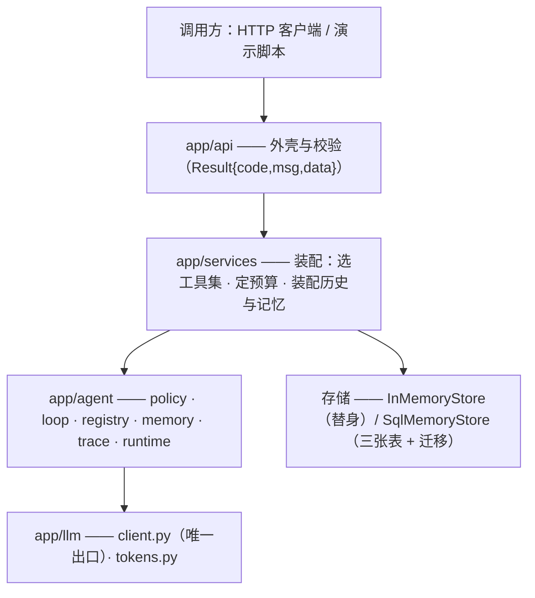

# 3.10 项目实战：知舟 Agent 版从零到一

## 本章导读

前九章各自交付了一个能独立验收的增量：词元账、模型出口、循环、计划、工具集、记忆、
编排、护栏、观测。它们每一个都有自己的测试、自己的验收命令，而且**彼此不认识**——
`loop` 不知道 `memory` 的存在，`registry` 不知道 `trace` 的存在。

这一章不再加新零件，只回答一个问题：**这些东西拼在一起，是一个能跑、能演示、
能被人问住时不心虚的服务吗？**

答案要落到三样可交付的东西上，而不是一段描述：

- 一份**架构图**（`docs/architecture.md`）：谁在调谁、数据从哪进、账从哪出；
- 一份**端到端验收测试**（`tests/test_acceptance.py`）：三条演示路径在**HTTP 层**上真的跑通；
- 一个**一键脚本**（`scripts/acceptance.py`）：起服务、跑三条路径、打印读数，一条命令。

验收标准写在 [`PROJECT.md`](PROJECT.md)：**一键起服务 → 三条演示路径全通（问答 / 草稿 /
跨会话续跑）**。同一份文件里还有一句更难的：**含 5 分钟讲法与追问防御**——
所以本章的后半部分不是代码，是**你怎么把这些代码讲清楚**。

## 学习目标

读完本章，你应该能够：

1. 说清「装配层」在一个 LLM 应用里的职责，以及为什么零件之间不该互相调用；
2. 分辨**写了**与**接上了**：一条新增的能力，从函数到端点要经过哪几步；
3. 写出一个一键验收脚本，并说清它的三个关键决定（端口、等待方式、进程回收）；
4. 在 HTTP 层写端到端测试：用依赖覆盖换掉模型，而不是绕开应用另建一个；
5. 给三条演示路径设计断言，并为每一条配一条**反向守**的用例；
6. 用「问题 → 做法 → 数字 → 取舍 → 下一步」五段式做一次 5 分钟项目讲述；
7. 面对追问时给出**有数字、有边界**的回答，而不是背一段技术名词。

## 前置知识

- 第 3.3 节的循环与五类终止条件：本章的三条路径最终都落在这个循环上；
- 第 3.6 节的会话与长期记忆：路径三要验的是「新会话历史为零但召回得到偏好」；
- 第 3.8 节的护栏与人工确认：路径二要验的是「起草执行、发布停下」；
- 第 3.9 节的指标与评测：本章的脚本报的是同一套读数，门与读数分家也出自那里；
- 第 1.9 节的 FastAPI 依赖注入与第 1.14 节的测试分层：本章用它们做端到端验收。

## 3.10.1 组装：十段增量怎么拼成一个服务

先看结果。这棵树的分层是固定的，**每一层只允许调用它下面的一层**：



**三条不变量**（绕过去就等于绕过了整篇的测试）：

1. **一切模型调用走 `app/llm/client.py`**。别的模块不得直接发 HTTP。
2. **一切工具经 `app/agent/tools/registry.py`**。参数校验、权限档、幂等键、体积裁剪都在那一层。
3. **每一个步骤都写进 `app/agent/trace.py`**。指标是它的聚合，不是另算一遍。

为什么要有装配层？因为**零件之间的组合方式会变，零件本身不该跟着变**。
同一个 `run_agent` 循环，被三种组合用着：单次问答（`/chat`，无历史）、
带记忆的一轮（`/session/chat`，装配四策略）、子代理（`orchestrator` 里的 `run_subagent`）。
如果循环自己去查会话、自己去记指标，这三条路会立刻分叉成三份互不兼容的代码。

装配层的判断标准只有一条：**把它删掉，零件还在不在**。
在，说明它只负责拼装；不在，说明它把职责偷偷藏进去了。

### 一次带记忆的请求

静态的分层图回答「谁能调谁」，回答不了「顺序为什么是这样」。下面这张时序图回答后者：

```mermaid
sequenceDiagram
    autonumber
    participant U as 调用方
    participant API as api/agent.py
    participant SVC as AgentService
    participant MEM as MemoryStore
    participant LOOP as loop + policy
    U->>API: POST /api/v1/agent/session/chat
    API->>SVC: session_chat(task, session_id?)
    SVC->>MEM: ① 取历史快照（不含本轮）
    SVC->>MEM: ② 先把用户这一轮落库（写前日志）
    SVC->>MEM: ③ 召回长期记忆
    SVC->>SVC: 装配（full / clean / note / compress）
    SVC->>LOOP: run_agent（装配后的历史 ＋ 本轮）
    LOOP-->>SVC: LoopResult（终态 ＋ 账 ＋ 轨迹）
    SVC->>MEM: ④ 一次性回写轨迹与答案，并抽出偏好
    SVC-->>API: 响应体（含 memory 与 trace）
    API-->>U: Result{code, msg, data}
```

**四步的顺序都不能换**，理由各自具体：① 在 ② 之前，否则本轮的提问会被算进
「上一轮以前的历史」，同一个问题在装配里出现两次；③ 在 ② 之后，这一轮刚说出的偏好
也要能被召回；④ 必须一次性写，半截轨迹落库会装出一个**非法请求**——
服务商要求 `tool` 消息紧跟声明同一个 id 的 `assistant` 消息，而轨迹是跑完才生成的。

## 3.10.2 写了不等于接上了

这一节要谈一个几乎每个项目都会踩、但很少被写下来的问题。
把十个零件的调用关系从代码里查出来（`grep -rn "guardrails\|orchestrat" app/ demo.py`），
得到的是一张**比想象中稀疏**的表：

| 零件 | 谁在调它 | 走一次 `/chat` 会经过它吗 |
| --- | --- | --- |
| `llm/client.py`、`tokens.py` | `policy`、`services` | 会 |
| `agent/runtime.py`、`loop.py`、`policy.py` | `services` | 会 |
| `tools/registry.py`、`tools/zhizhou.py` | `services` | 会 |
| `agent/memory.py` | `services`（`/session/chat` 那条路） | 会 |
| `agent/trace.py` | `services` ＋ 端点里进程级一份 | 会 |
| `agent/plan.py` | `api` 的 `/agent/plan` | 只在那一个端点上 |
| `agent/guardrails.py` | **`demo.py`、`experiments/`、测试** | **不会** |
| `agent/orchestrator.py` | `demo.py --only 5`、`experiments/multi_agent_cost.py` | **不会** |

最后两行是实话：**护栏与编排这两段增量，交付的是函数，不是端点**。
`guarded_bind` 有 33 条测试、在演示路径六里真的拦下过注入，`orchestrate` 在路径五里真的
跑过三个子代理——但线上那条 `/chat` 走的是**未加护栏的** `bind_tools`。

**这不是「忘了一行」，是一种顺序。** 一个能力从「写了」到「接上了」要经过三步：
① 有实现、② 有测试与演示（说明它在真实路径上能用）、③ 由需要它的人把它接进装配层。
三步的顺序不能换：反过来做，等于在没有测试的情况下改所有人的请求路径。

而**第三步的代价是零**，这正是当初把 `guarded_bind` 做成与 `bind_tools` **同形**
（同样的参数、同样的返回值）的原因：接的时候改的是 `services/agent_service.py` 里的一行构造，
零件一行不动。判断一个能力「接起来贵不贵」，看的从来不是它有多少行代码，
而是**它和现有装配的接口是不是同形的**。

自查这件事只需要三条命令，都是只读的：

```bash
# ① 谁在调它：表里每一行都能复现
grep -rn "guardrails\|orchestrat" app/ demo.py experiments/
# ② 端点上到底挂了什么（两条依赖、六条路由）
grep -n "dependency\|router\|get_" app/api/agent.py
# ③ 新目录有没有进门的范围（脚本自己也在正文里贴了）
grep -n "PATH_RE" tools/check_runnable.py
```

第三条最容易被忘记：**门只校验它认识的目录**。这一次加 `scripts/` 时才发现，
新脚本落在门的范围之外——那个脚本的每一个代码块都不会被校验，而输出里照样是「全部命中」。
**校验器告诉你「通过了」，不等于它看过你新加的东西**，这与写死清单是同一类漏账。

> **面试里的用法**：被问「你的护栏上线了吗」，正确答案不是「上了」，也不是「没上」，
> 而是「实现与测试在，演示路径六里接上了，服务端点没接——接它要改一行，代价是每次请求
> 多一次扫描；我把它留成了开关，因为当前是单用户本地跑，误杀的代价高于入侵的代价」。
> 这句话里同时有**事实**、**代价**与**理由**，三者缺一个都会显得像没做完。

## 3.10.3 一键起服务：验收脚本的三个决定

验收脚本（`scripts/acceptance.py`）只做一件事：**起服务 → 跑三条路径 → 打印读数**，
一条命令。它有两个模式，区别只在「服务在哪」：

```bash
python scripts/acceptance.py --offline   # 不需要密钥：进程内起应用，HTTP 面是真的
python scripts/acceptance.py             # 需要密钥：真起 uvicorn，走真端口
```

三个决定值得单独讲，因为它们各自都对应一次踩过的坑。

### 决定一：端口由操作系统挑

```python
# scripts/acceptance.py —— 一键入口：离线那一路复用机检的同一批用例（节选）
def free_port() -> int:
    """让操作系统挑一个空闲端口：写死 8000 会撞上别人正在跑的服务。"""
    with socket.socket() as s:
        s.bind(("127.0.0.1", 0))
        return int(s.getsockname()[1])


def offline() -> int:
    import test_acceptance as acc                   # noqa: PLC0415 —— 只有这一路才需要它

    print("== 一键验收（离线：真实 HTTP 面 ＋ 剧本模型）==")
    qa = acc.path1_qa()
    draft, env = acc.path2_draft()
    resumed, first = acc.path3_memory()
```

写死端口是脚本类工具最常见的坏味道：**你的机器上能跑，别人的机器上起不来，
而报错是 `Address already in use`，看起来像服务坏了**。绑定 0 让内核给一个空闲端口，
这个数字再传给客户端，脚本就与机器状态无关了。

注意 `offline()` 里那三行：它**没有自己写三条路径**，而是调用机检用的同一批函数。
这不是省事，是让「打印给人看的读数」与「门里跑的断言」**不可能分叉**——
两处各写一遍，改了一处忘了另一处，读数就会开始撒谎。

### 决定二：等服务起来，而不是 sleep 一个猜的数

```python
# scripts/acceptance.py —— 真机那一路：等服务真的起来，而不是 sleep 一个猜的数（节选）
        deadline = time.time() + timeout
        while True:                                             # 等服务真的起来，而不是 sleep 一个猜的数
            if time.time() > deadline:
                print(f"✖ {timeout:.0f}s 内没等到 /healthz（服务是否起得来？）")
                return 1
            try:
                if httpx.get(f"{base}/healthz", timeout=1.0).json().get("ok"):
                    break
            except Exception:                                   # noqa: BLE001 —— 起来之前连不上是正常的
                time.sleep(0.3)
```

`time.sleep(3)` 有两种失败方式，而且都难查：机器慢时服务还没起来（脚本报错，
但服务是好的），机器快时白等两秒（没人会去修）。**轮询一个健康检查 + 一个有上限的截止时间**，
两种情况都消失：快就快，慢就等，等不到就说清等的是什么。

顺带一个细节：`/healthz` 返回里带 `model`，所以真机跑的第一行就告诉了读者
**这一次是拿哪个模型验的**——验收记录里没有这一条，事后没人知道当时比的是什么。

### 决定三：无论成败都要收掉那个进程

真机那一路是 `subprocess.Popen` 起的 uvicorn，整段跑在 `try/finally` 里，
`finally` 里 `terminate()`，超时再 `kill()`。少了这一步，脚本失败时会在后台留下一个
占着端口的服务，**下一次运行就会撞上它自己上一次留下的尸体**。

演示给面试官看的时候，这一类问题最致命：你按了一次、报了个错、再按一次又报了个错，
而原因是你自己上一次没清理干净。

### 为什么两路都留着，而不是只留离线

只留离线的话，**真机跑不通这件事永远不会被发现**：`TestClient` 走的是进程内的 ASGI，
它绕过了端口、进程、环境变量与 uvicorn 的启动过程——而这四样恰恰是部署时最先出问题的地方。
只留真机的话，验收就变成了「要密钥、要网、要钱」的东西，一旦它失败，你分不清是代码错了
还是服务商抖了。

所以分工与第 3.9 节的门与读数完全一致：**离线那一路当门**（确定性、秒级、不要密钥，
已接进机检），**真机那一路只报读数**（它证明的是「服务真的能起来、真的能连上模型」这件事，
不是「代码没退步」）。两路共用同一批路径函数，是让这两种职责不互相污染的办法。

## 3.10.4 端到端验收为什么落在 HTTP 层

三条路径早就用 `demo.py` 跑过了，它能直接调服务对象、绕过 HTTP。那为什么还要再写一份？
因为**绕过 HTTP 就绕过了三种真实的故障**：

- **路由与依赖装配**：`get_agent_service` 要密钥、`get_memory_service` 不要——
  这条分叉写错了，现象是「查会话历史在没配密钥的机器上返回 500」；
- **请求校验**：`max_steps` 的上界、`task` 的长度、`policy` 的取值，都由 pydantic 拦；
- **响应外壳**：`Result{code, msg, data}` 是给客户端的承诺，字段名改了没人会知道。

而 HTTP 层测试的常见退化写法是「另建一个小应用只挂这一个路由」——
那就等于把上面三样一起绕过去了，测出来的绿是没有意义的绿。正确做法是
**用依赖覆盖换掉模型，应用本体一行不改**：

```python
# tests/test_acceptance.py —— 只换依赖，不换应用（节选）
    # 两个依赖都要换。只换 `get_agent_service` 的话，会话与指标端点会走回真装配
    # （它要从环境变量读密钥），现象是一个 500——而报错与路由本身毫无关系。
    app.dependency_overrides[get_agent_service] = lambda: svc
    app.dependency_overrides[get_memory_service] = lambda: svc
    return TestClient(app), svc
```

这段注释里那件事值得单说：**只换一个依赖**是这类测试最常见的错法。
`/chat` 会走新的服务，`/session/chat` 和 `/metrics` 走旧的——后者要读环境变量里的密钥，
于是没配密钥的机器上这两个端点返回 500，而这个 500 与路由、与业务逻辑都毫无关系。
「一个测试里换了两处依赖」这件事本身没有技术含量，**但它是不是被写下来**，决定了
下一个人加第三个依赖时会不会漏。

还有一层比外壳更基础的约定：**HTTP 层必须是 200，`code` 才是业务码**。
这两件事混在一起写，就会有人把「模型没配好」当成「接口 500」来排查：

```python
# tests/test_acceptance.py —— HTTP 层与业务层分开判（节选）
def _post(c: TestClient, path: str, body: dict) -> dict:
    """一次 POST，并顺带把「HTTP 层必须是 200」这条钉死：外壳内部才谈 code。"""
    resp = c.post(path, json=body)
    assert resp.status_code == 200, f"{path} → {resp.status_code} {resp.text[:200]}"
    return resp.json()
```

它顺带解决了一个调试体感问题：断言失败时打印的是**这个端点的真实状态码与前 200 个字符
的响应体**。没有这一句，测试失败只告诉你 `KeyError: 'data'`——那既可能因为路由 404，
也可能因为 422 的参数校验，而两者要用完全不同的方式去修。

## 3.10.5 三条路径的断言与一条反向守

路径三最能说明「断言该断在哪一层」。它要证明的是「新会话能接上旧任务」，
而结论落在三个**互相独立**的读数上：

```python
# tests/test_acceptance.py —— 路径三：三次断言分得开（节选）
def path3_memory() -> tuple[dict, dict]:
    """③ 跨会话续跑：会话 A 定下偏好，新开的会话 B 直接要求发布。返回 `(B 的响应, A 的响应)`。"""
    c, _ = client("好，以后发布我先给你看草稿。",
                  "必须先给你看草稿才能发布。")
    a = _post(c, "/api/v1/agent/session/chat",
              {"task": "记住：以后发布一律先给我看草稿。"})
    b = _post(c, "/api/v1/agent/session/chat",
              {"task": "把 42 号文章发布上线。", "allow_write": True})
    return b, a
```

| 声称 | 断言 | 它排除掉的错法 |
| --- | --- | --- |
| 第二个会话是**新开的** | `session_id` 不相等 | 复用会话 → 其实是长上下文，不是记忆 |
| 它没有上一轮历史 | `history_messages == 0` | 把历史一起带过去 → 记忆的作用被掩盖 |
| 它靠长期记忆接上 | `"pref.publish" in recalled` | 恰好猜对 → 与记忆无关 |
| 偏好真的进了提示 | 回答里含「草稿」 | 召回了但没装配进提示 |

四条缺一条，「打通了」就可能是巧合。**这也解释了为什么第三条路径要单独做**：
它和前两条验的东西不同——前两条验「做没做完」，它验「信息有没有跨过会话边界」。

### 指标那条：把「窗口」也写成断言

指标是只读的，很容易被写成「端点返回 200 就算过」。那样等于没测。真正要钉的是
**窗口语义**：它是「最近 N 次」而不是「从进程启动至今」——后者在长跑进程里会越来越钝，
而没人会去重启它：

```python
# tests/test_acceptance.py —— 窗口有界，分布才会跟着变（节选）
def test_指标端点不要求密钥且窗口有界() -> None:
    c, _ = client("答案")
    for task in ("第一件事。", "第二件事。", "第三件事。"):
        _post(c, "/api/v1/agent/chat", {"task": task})
    m = c.get("/api/v1/agent/metrics", params={"window": 2}).json()
    assert m["code"] == 0
    assert m["data"]["runs"] == 2                                  # 窗口是最近的 N 次，不是“从启动至今”
    assert m["data"]["failure_distribution"] == {"成功": 2}         # 所以分布也只有两个样本（有限档，不是原话）
    assert m["data"]["cost"] is None                               # 没配单价就不编一个价
```

三条断言各拦住一类错法：跑了三次却报 3 次样本，说明 `window` 被忽略了；分布里的键不是
有限档，说明终止原话被当成了分类；没配单价却报出一个成本，说明有人在编数。
最后一条看着琐碎，但它是**整张指标表可不可信的前提**——一个会被编出来的数，
会让同一张表里的其它数也失去可信度。

### 两条不是「业务失败」的边界

统一外壳有一个很容易被用错的倾向：**把所有不如期待的结果都包成 `code != 0`**。
参数写错了、对象不存在、模型没配好——全塞进 `data` 里变成一段文案，客户端只能靠字符串匹配
去判断，于是自动重试、监控告警、前端提示全部失灵：

```python
# tests/test_acceptance.py —— 两条边界要分清（节选）
def test_参数越界与不存在的资源走HTTP语义() -> None:
    """两条边界要分清：**请求本身不合法**（422）与**请求合法但对象不存在**（404），
    都不该伪装成一个 `code != 0` 的正常响应——那会让调用方只能靠读文案来判断。"""
    c, _ = client("答案")
    assert c.post("/api/v1/agent/chat", json={"task": "x", "max_steps": 99}).status_code == 422
    assert c.get("/api/v1/agent/session/999999").status_code == 404
```

分界很简单：**HTTP 状态码管传输与请求合法性，`code` 管业务结果**。
`max_steps=99` 超出了声明的范围，它连业务逻辑都没进去，所以是 422；
会话 999999 是合法的请求但对象不存在，所以是 404；而「模型超时」就是业务结果，
它必须是 200 ＋ `code=2` ＋ 一个可读的 `data.kind`——因为它完全可能在重试一次后成功。

### 一条反向守：让「没发生」和「发生了」分得开

路径二要验「发布被人工确认拦下」。危险在于：**如果发布这条路根本走不通，这条断言也会绿**。
拦住它的是审批回调、是工具子集、还是根本没注册这个工具？光看「没发布」是分不出来的。
所以配一条反向守——一条“放行时它真的会执行”的用例：

```python
# tests/test_acceptance.py —— 反向守：发布这条路真的走得通（节选）
def test_路径二_审批放行时发布真的会执行() -> None:
    """反向守：上面那条断言不能因为「发布这条路根本走不通」而通过。"""
    _, env = path2_draft(allow_approve=True)
    assert env["draft"] == "published"
```

**每一条「某某被拦住了」的断言旁边，都该有一条「放行时它真的会执行」。**
否则你验的是「这门锁着」，而不是「这扇门装了一把锁」。

### 离线的读数

```text
== 一键验收（离线：真实 HTTP 面 ＋ 剧本模型）==
① 问答（只读）      steps 2｜calls 2｜tokens 6｜reason 模型给出最终答案
   工具：['read_article']
② 草稿（写）        steps 3｜calls 3｜tokens 6｜reason 模型给出最终答案｜环境终态 draft
   工具：['create_draft', 'publish_article']
③ 跨会话续跑        新会话 2（上一个 1）｜历史 0 条｜召回 ['pref.publish', 'task.last']
   答案：必须先给你看草稿才能发布。
✔ 三条路径全通
```

### 真机的读数

```text
== 一键验收（真机：http://127.0.0.1:6773，模型 agnes-2.5-flash）==
① 问答（只读）      steps 2｜calls 2｜tokens 3861｜reason 模型给出最终答案
   工具：['read_article']
② 草稿（写）        steps 4｜calls 3｜tokens 6618｜reason 模型给出最终答案
   工具：['read_article', 'create_draft', 'publish_article']  ← 发布被拦在确认那一步
③ 跨会话续跑        历史 0 条｜召回 ['pref.publish', 'task.last']
   答案：根据记忆偏好，发布前需要先给你看草稿。……请告诉我：要发布第 42 号文章的什么内容？
指标：{"runs": 4, "success_rate": 1.0}｜失败分布 {'成功': 4}
```

两份读数要**连着读**：离线那份里 `tokens 6` 不是「省了钱」，是剧本模型的响应里
词元数是编的（剧本不产生真实词元账），**确定性是它的优点，量级不是**。
要讲成本，用的是真机那份：一次只读问答 3,861 词元，一次起草 6,618 词元。

## 3.10.6 从零到一：这条主线是怎么长起来的

十段增量的顺序不是随意的，它对应**一个应用的成长顺序**：
先有钱账（词元）、再有出口（客户端）、然后是循环、计划、工具、记忆、分工、护栏、观测，
最后组装。每一段都满足两条要求：**能独立验收**、**不破坏前面任何一段的验收**。

| 章 | 增量 | 一条能照抄的验收命令 | 它证明了什么 |
| --- | --- | --- | --- |
| 3.1 | 词元账与上下文预算 | `python -m pytest tests/llm/test_tokens.py -q` | 钱花在哪一段提示上，误差 0 |
| 3.2 | 第一次模型调用 | `python -m pytest tests/llm/test_client.py -q` | 超时有界、重试可控、结构化输出失败可分类 |
| 3.3 | 最小代理循环 | `python demo.py --only 3` | 五类终止条件都生效 |
| 3.4 | 计划层 | `python -m pytest tests/agent/test_plan.py -q` | 坏计划在动第一个工具之前被拦下 |
| 3.5 | 工具集 | `python -m pytest tests/agent/test_tools.py -q` | 越权、非法范围、重复写都被拒 |
| 3.6 | 记忆与装配 | `python experiments/memory_cost.py` | 峰值上下文降 85% 且事实没丢 |
| 3.7 | 多 Agent | `python experiments/multi_agent_cost.py` | 分工买到的不是省钱，是并行与第二视角 |
| 3.8 | 护栏 | `python experiments/injection_corpus.py` | 检出率与误杀率都有数 |
| 3.9 | 观测与评估 | `python experiments/eval_run.py --offline --check` | 退步拦得住 |
| 3.10 | 组装 | `python scripts/acceptance.py --offline` | 三条路径在 HTTP 层全通 |

### 如果你要自己建一条等价的主线

**没有跟着敲这十段也没关系**——面试要的不是这个项目的复刻，而是一条你自己能解释清楚的主线。
最小要求是四条路径，每一条都对应一个**只有它才能证明**的结论：

| 路径 | 最小做法 | 它证明的东西（少了它说不出什么） |
| --- | --- | --- |
| **只读** | 一个检索/查询工具 ＋ 循环 | 循环真的在转：工具是模型选的，不是代码写死的 |
| **写** | 起草类动作 ＋ 权限档 ＋ 人工确认 ＋ 幂等键 | 你有边界，不只有功能；重复请求不会写两次 |
| **跨会话** | 一张偏好表 ＋ 一次召回 | 记忆不是「上下文变长」：新会话历史为零也能接上 |
| **被拦下** | 一份投毒输入或一次越权调用 ＋ 一条拒绝对话 | 你能说出防线在哪一层，而不只是「模型会拒绝」 |

四条路径的**建法有顺序**：先把只读路径打通（它验证模型出口与循环），再加写路径
（它验证权限与确认），然后才是记忆（它验证装配），最后加边界（它验证你前面三样没被绕过）。
顺序反了不会报错，只会让你在还没有可观测性的时候，就去调一个更难的问题。

至于**篇幅**：四条路径大概对应 1,500–3,000 行代码。这不是一个「周末项目」的体量，
也不是「先写完再想怎么讲」的体量——**每加一条路径就补一次它的验收命令**，
到最后那一章（也就是这一章）才有东西可组装。

## 3.10.7 五分钟讲法：把项目讲成一段话

面试里给你五分钟讲项目，**大多数人的失败方式不是讲得浅，而是把功能列表念一遍**。
面试官不关心它有几个端点，他关心的是：你遇到了什么、你怎么权衡的、代价是什么。
一个能反复用的骨架是五段式：

| 段 | 内容 | 时长 | 你必须有 |
| --- | --- | --- | --- |
| ① 问题 | 一句话说清「谁在什么场景下遇到什么麻烦」 | 30 秒 | 一个具体场景，不是「AI 很火」 |
| ② 做法 | 系统由哪几块构成、每块的职责 | 60 秒 | 一张脑内架构图（本章第一节那张） |
| ③ 数字 | 三到五个可比的读数 | 90 秒 | 成本、延迟、质量、边界各一个 |
| ④ 取舍 | 你**放弃了**什么，为什么 | 90 秒 | 至少两个「没做」以及代价 |
| ⑤ 下一步 | 现在最该补的一块，以及如何验证 | 30 秒 | 一条可执行的验收 |

拿本项目示范一遍（③ 全部来自本机的实测读数）：

> **① 问题**：知舟是一个内容站，用户问「有没有讲过刷新令牌的文章」，站内搜索只能给关键词命中，
> 不能读、不能总结、不能接着上一轮往下问。
> **② 做法**：我没有引框架，手写了九个零件——模型出口、循环、计划、工具集、记忆、多 Agent、
> 护栏、观测——分成十段增量长起来，每段都有独立的验收命令。
> **③ 数字**：一轮只读问答约 3,861 词元，其中 96.6% 是输入（历史每轮重发是主要成本），
> 所以装配从 `full` 换成 `note` 之后峰值上下文降 85%；同一任务多 Agent 与单 Agent 词元只差 7%
> （4,590 对 4,913），但并发 3 时墙钟从 19.2 秒降到 3.7 秒——**分工买到的是并行度，不是省钱**；
> 护栏的样例集 26 条，检出 12/12，硬拦截 9/12，误杀率按通道分成 2/14。
> **④ 取舍**：我没接向量库，只查自己的数据库——够用，且省掉一整条索引链路；
> 护栏在演示路径里接上了、服务端点没接，因为单用户本地跑时误杀的代价高于入侵代价，
> 我把它留成了开关；编排交付的是函数而不是端点，因为它的用户是实验脚本而不是终端用户。
> **⑤ 下一步**：接护栏开关并测一次误杀率，验证在真实请求分布下它值不值。

**四条禁忌**，比技巧更重要：

1. **别报点数**。「我实现了六个端点、三张表、150 条测试」——测试条数是你自己的事，
   面试官关心的是它拦住了什么；
2. **别用形容词替代数字**。「性能提升明显」不如「p95 从 26.9 秒降到……」——
   数字可以追问，形容词只能引起怀疑；
3. **别说「没有缺点」**。一个说不出边界的项目，等于承认没测过边界；
4. **别讲你没做过的部分**。第 4 篇才用框架重写，那就别在讲手写实现时说「框架的部分我也了解」。

### 开场与收尾

开场只说一件事：**你要解决的是什么问题**，并且带一个具体的场景
（「站内搜索只能给关键词命中，用户想问『有没有讲过 X』时只能自己翻」）。
不要从「随着大模型的发展」开始——那两句话不提供任何信息，却会把你后面四分钟的可信度先预支掉。

收尾只留一个「下一步」，而且要是**可验收的**那一条
（「接护栏开关并测误杀率」），不要用「继续优化性能」这种没有验收标准的句子收尾。
**收尾决定面试官下一个问题问什么**，而一个有具体判据的下一步，会把追问引到你准备过的地方。

### 答不上来时怎么办

十八个问题里有五六个你也会被问到答不上来，这时候**猜一个数是最差的选项**：
一个错的数字比一句「没测过」扣的分多得多。可以用的有三种回答：

1. **给边界**：「这个数我没测过，但我知道它的上界——输入词元随步数平方增长，
   所以 8 步的会话里输入占比一定高于单次调用；要测的话我会跑同一题在 1/4/8 步下的三个点」；
2. **给方法**：「没量过。量它只要一个脚本；我现在能确定的是它不受模型影响，因为装配是纯函数」；
3. **给取舍**：「没做，因为……；如果要做，代价是……；我选择先做了……，因为它更早暴露问题」。

三种回答的共同点是**它们都能被继续追问下去**，而你自己知道那是你的地盘。
这就是为什么本章前半部分一直在算账：**数字不是为了好看，是为了让「不知道」也有边界**。

## 3.10.8 追问防御：会被问到的十八个问题

追问的目的不是考倒你，是**验证那个数字是不是你的**。所以回答的骨架永远是三件：
**给数、给边界、给下一步**。下表按主题分组，每一行的「答法骨架」是要点，不是台词。

| # | 问题 | 答法骨架 |
| --- | --- | --- |
| 1 | 为什么不直接用 LangChain / LangGraph？ | 先手写才知道框架替你做了什么；第 4 篇用框架重写同一件事，再对照哪一层被省掉、哪一层被藏起来 |
| 2 | 手写循环最难的是哪一步？ | 终止判定：模型只提「下一步做什么」，收口与上限是运行时的责任；五类终止条件各拦一类错 |
| 3 | 一次问答为什么能花掉几千词元？ | 输入占比 96.6%——**历史每轮重发**，工具结果是大头（一篇三千字正文被截到 2,000 字符后仍反复重发） |
| 4 | 怎么把成本降下来？ | 三条路都有实测：装配降 85%、截断与摘要、前缀可复用；上游还有缓存与路由（第 6 篇） |
| 5 | 多 Agent 省了钱吗？ | 没省：4,590 对 4,913 词元只差 7%；它买的是并行度（19.2 秒 → 3.7 秒）与第二视角 |
| 6 | 子代理为什么会「什么都不知道」？ | 子代理不共享上下文，交接单是唯一通道；单子里没写的东西它就是没有——路径五第一次跑就是这么失败的 |
| 7 | 记忆和上下文变长有什么区别？ | 会话二历史 0 条、靠召回 `pref.publish` 接上；如果是长上下文，历史不为零 |
| 8 | 长期记忆会不会越存越多？ | `key` 按用户唯一、同键覆盖不追加；写入必须显式回答保留期（默认 180 天），用户能删 |
| 9 | 提示注入防住了吗？ | 样例集：检出 12/12、硬拦截 9/12；真机两轮模型都没上当，但**那不是控制措施**——判据落在模型身上的防线都不算 |
| 10 | 那什么算控制措施？ | 白名单、权限预算（Rule of Two）、人工确认、幂等键——四档对照表里 published/published/draft/draft，差别全在结构 |
| 11 | 你的评测可信吗？ | 离线 6 条用例 15 次试验，判产出与终态、不判路径；真机 40% 成功率里 9 次是服务商中断，去掉后模型侧 6/6 |
| 12 | 那 40% 能不能当门？ | 不能。门只收离线基线，真机读数只报——它会抖、要网、要钱，当门的结果是被人加白名单 |
| 13 | 并发下同一个会话会不会串？ | 会话按 id 取快照再装配，写回是一次性的；真正的风险在真库的隔离级别与连接池（第 1.12 节的账） |
| 14 | 写操作安全吗？ | 三道闸：权限档、循环生成的幂等键、发布必须人工确认且默认不批 |
| 15 | 这套东西上线还缺什么？ | 缺部署与前端（第 8 篇）、网关与路由（第 6 篇）、护栏开关；**性能与多租户都还没测过** |
| 16 | 这代码是你写的还是 AI 写的？ | 直接说清分工：循环与契约手写，测试与重复结构借助工具生成，每一段的验收命令都跑过——**能说出哪个数字是怎么来的，就是你的** |
| 17 | 如果重来你会改什么？ | 把「接线状态表」提前到项目开始就维护：写了 ≠ 接上了，这件事越晚发现越贵 |
| 18 | 这套架构什么时候该换？ | 需求出现多租户、多模型路由或可视化编排时；那时框架买到的不是省代码，是把约定变成社区共识 |

## 3.10.9 知舟接线

### 加了什么

这一节不加新零件，只做**组装**：把 3.1–3.9 的九段增量拼成一个能起、能演示的服务，
并给「拼得对不对」装上机器可校验的三样东西——架构图、端到端验收测试、一键脚本。
它属于 v3 的最后一段：**3.10 组装段**。

### 接口契约

| 新增（修改） | 内容 | 验收 |
| --- | --- | --- |
| `docs/architecture.md` | 分层图、时序图、三张表、**接线状态表**、旁路与主链路 | 与代码一致：表里每一条都能用 `grep` 复现 |
| `tests/test_acceptance.py` | 8 条用例：三条路径 ＋ 外壳 ＋ 回放与会话 ＋ 指标 ＋ 404/422 ＋ 反向守 | 不需要密钥、不起端口，跑在完整应用上 |
| `scripts/acceptance.py` | `--offline`（进程内）与真机（uvicorn + 真端口）两路 | 一条命令打印三条路径的读数 |
| `tools/check_runnable.py` | **把 `scripts/` 纳入校验范围** | 新目录进正文的代码块不再静默漏检 |

它依赖的零件：`services/agent_service.py`（装配）、`api/agent.py`（端点与两条依赖）、
`agent/trace.py`（指标）、`agent/memory.py`（会话与召回）、`llm/client.py`（唯一出口）。

### 怎么验

**实跑**（不需要密钥，也不起端口——`TestClient` 走的是真实 ASGI 链路）：

```bash
cd zhizhou-v3
python scripts/acceptance.py --offline   # 打印三条路径的读数，末尾「✔ 三条路径全通」
python tools/check_runnable.py           # 从仓库根目录：正文代码块 ↔ 可运行树（含 scripts/）
```

**实跑**（需要凭据，真起服务、真端口、真模型）：

```bash
cd zhizhou-v3 && cp .env.example .env    # 填 LLM_API_KEY / LLM_BASE_URL / LLM_MODEL
set -a; source .env; set +a
python scripts/acceptance.py             # 起 uvicorn → 跑三条路径 → 收掉进程
```

真机这一次的读数是：① 2 步 / 3,861 词元；② 4 步 / 6,618 词元，发布被确认那一步拦下；
③ 历史 0 条、召回 `['pref.publish', 'task.last']`；指标 `runs=4`、成功率 1.0。

**拼接验证**：`SqlMemoryStore` 的真实库往返仍属这一类（本机没有 MySQL），
镜像的第 1 篇那部分沿用 1.15 的声明。

### 不能破坏什么

- **不改端点的请求 / 响应形状**：本章只加测试与脚本，`Result{code, msg, data}` 一行不动；
- **测试里不许另建应用**：只换依赖（`dependency_overrides`），否则路由、校验、
  外壳三样一起被绕过去，绿得没有意义；
- **不许把 `--offline` 那一路的读数当成本数据**：剧本模型不产生真实词元账，
  成本一律引真机读数；
- **新增目录要进门的范围**：`scripts/` 加进 `check_runnable.py` 之前，正文里那个脚本
  一个块都不会被校验，而输出照样是「全部命中」——与写死清单是同一类漏账；
- **一键脚本必须收掉自己起的进程**：`finally` 里 `terminate()`，
  否则下一次运行会撞上上一次留下的端口。

## 常见坑

1. **把「写了」当成「接上了」。** 本仓库就有一例：护栏与编排交付的是函数，
   没接进服务端点。自查方式是查调用关系，而不是看文件在不在——**文件在不等于它被调用**。
2. **端到端测试另建一个应用。** 只挂一个路由的 `FastAPI()` 看起来更干净，
   但它同时绕过了路由装配、依赖与外壳校验，测出来的绿与线上无关。
3. **只换一半依赖。** `/chat` 走替身、`/session/chat` 走真装配，现象是没配密钥时
   后者返回 500——而这个 500 与业务逻辑毫无关系。
4. **脚本 `sleep` 固定秒数等服务。** 慢机器上失败、快机器上白等；改成轮询健康检查 + 截止时间。
5. **写死端口。** 你的机器能跑、别人的机器起不来，报错还像服务坏了。
6. **只验正向路径。** 「发布被拦下」必须配一条「放行时真的会发布」，
   否则验的是「门锁着」而不是「门上有锁」。
7. **拿真机读数当门。** 它会抖、要网、要钱；门要的是确定性（第 3.9 节）。
8. **把参数校验伪装成业务失败。** 请求本身不合法是 422，对象不存在是 404，
   两者都不该包成一个 `code != 0` 的正常响应——调用方只能靠读文案判断的接口，是没法自动重试的。
9. **让「测试通过」代替「服务能起」。** 端到端测试跑在进程内的应用上，
   它证不了端口、环境变量与启动过程没问题；这就是还需要一键脚本的原因。
8. **讲项目时念功能列表。** 不报点数、不用形容词替数字、不回避取舍——三段里缺一段，
   面试官就会自己补一个对你更不利的答案。

## 面试视角

- **「你这个项目的架构能画一下吗」**：画**调用关系**，不是目录树。四条边就够：
  客户端 → 端点 → 装配 → 零件 → 模型出口；然后补一句「零件之间不互相调用，所以每段能单独测」。
- **「最难的地方是什么」**：说一个**有代价的决策**。例如「护栏是否进服务端点」：
  接上去代价是每次请求多一次扫描、误杀会打断正常用户；不接的代价是注入面敞着。
  我选了不接并留成开关——**理由要跟着场景走**（单用户本地 vs 多租户线上，答案相反）。
- **「你测试写了多少」**：不要报总数，报**它拦住了什么**：
  「五类终止条件各有用例」「发布被拦下有一正一反两条」「评测集判产出不判路径」。
- **「这套东西能上生产吗」**：给清单而不是给结论——缺部署、缺多租户隔离、
  缺网关与限流、缺护栏开关；已有的：幂等、确认、脱敏、审计、指标、回归门。
- **「AI 帮你写了多少」**：诚实说分工，并**用数字证明你懂**：
  「这一章的 8 条用例是工具生成的骨架，但每条断言断在哪一层是我定的——
  路径三为什么要断言三次，是因为那次少断言一次，长上下文会伪装成记忆」。
- **「你这个项目有什么不足」**：不要拿「时间不够」当答案。挑一个**结构性的不足**，
  比如「护栏没接进服务端点」或「指标体系只管单次运行，没有跨版本对比」——
  再说它的代价与修法。能自己指出结构问题的人，会被当成能改结构的人。

## 本章小结

1. **装配层只负责拼装**：判断标准是「把它删掉，零件还在不在」；
2. **写了不等于接上了**：三步是 实现 → 测试与演示 → 接进装配层；第三步便宜的原因
   是接口同形，而不是代码少；
3. **一键脚本的三个决定**：端口交给内核、服务靠健康检查轮询、进程用 `finally` 收掉；
4. **端到端测试落在 HTTP 层**：换依赖不换应用，两个依赖都要换；
5. **每条「被拦下」的断言配一条反向守**，否则验的是门锁着而不是门上有锁；
6. **五分钟讲法用五段式**：问题 → 做法 → 数字 → 取舍 → 下一步；
7. **追问防御的核心是给数、给边界、给下一步**：说不出边界的项目等于没测过边界。

到这里，知舟从「一次模型调用」长成了一个**能被观测、能被拦住、能被讲清楚**的服务。
下一章起进入第 4 篇：用 LangChain 与 LangGraph 把同一件事重写一遍，然后把两份实现
摆在一起对照——**框架替你做了什么，把什么藏了起来**。

## 练习

1. 把 `scripts/acceptance.py` 扩成四条路径：加一条**被护栏拦下**的注入路径，
   并说明为什么它必须与路径二分开（提示：路径二拦的是**没授权**，这条拦的是**不可信**）。
2. 用依赖覆盖写一条「模型超时」的用例：让剧本传输层抛一次 `LlmTransportError`，
   断言端点的响应是 `code=2` 且 `data.kind` 可读。再说清为什么这条不该进真机基线。
3. 给 `docs/architecture.md` 的接线状态表加一列「接上它的代价」，
   逐行填出「改哪个文件、每次请求多做什么」——至少填出护栏与编排两行。
4. 按五段式把自己的项目讲一遍并录音，然后数一数：**一共说了几个数字**。
   少于五个就重写第三段。
5. 用 `python scripts/acceptance.py` 跑一次真机，把读数记进 `PROJECT.md` 的实跑记录；
   如果某条路径没通，先判断是**服务的问题**还是**模型这次的选择**，写出你的判据。

## 延伸阅读

- FastAPI · Testing — https://fastapi.tiangolo.com/tutorial/testing/ ｜ `TestClient` 与端到端验收的基础写法
- FastAPI · Testing Dependencies with Overrides — https://fastapi.tiangolo.com/advanced/testing-dependencies/ ｜ 本章「换依赖不换应用」的官方依据
- Mermaid 官方文档 — https://mermaid.js.org/ ｜ 架构图与时序图的语法
