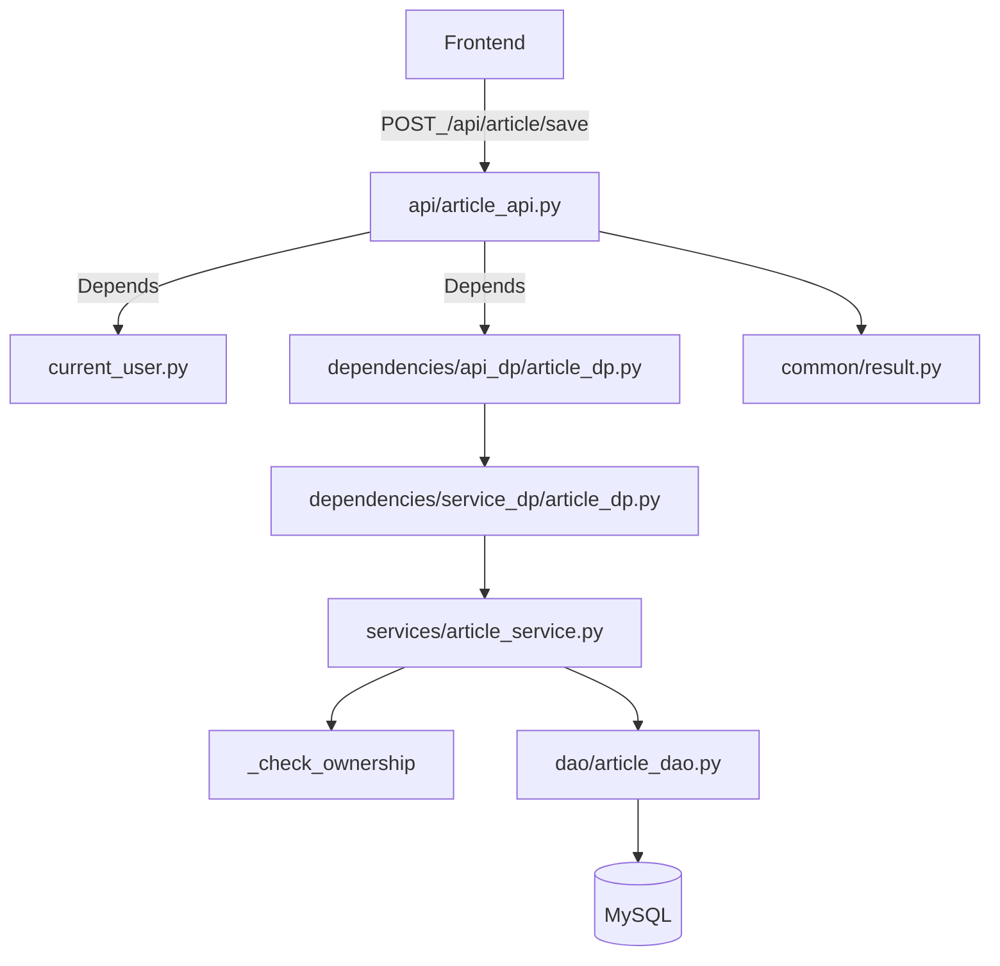

# 后端整体介绍（FastAPI）

> 对应后端目录：`fastapi_project/backend/app/`

## 1. 后端项目做什么
本后端提供一个“文章/评论/收藏/个人中心/用户登录注册”的 API 服务，主要能力：
- 首页文章列表（支持栏目筛选、搜索）
- 文章详情、草稿、新建/编辑、上传文章头图
- 评论与回复
- 收藏/取消收藏
- 个人中心：我的文章/我的收藏/我的评论
- 用户：验证码、邮箱验证码、注册、登录、注销、获取当前登录信息

## 2. 目录结构与分层
后端核心目录：
- `backend/app/main.py`：应用工厂与生命周期
- `backend/app/api/`：API 路由层（HTTP 入参解析、依赖注入、返回统一结构）
- `backend/app/services/`：业务服务层（业务校验、业务编排、权限校验）
- `backend/app/dao/`：数据访问层（SQLAlchemy 查询/写入）
- `backend/app/models/`：SQLAlchemy ORM 模型
- `backend/app/schemas/`：Pydantic 请求/响应模型（req/res）
- `backend/app/config/`：配置、数据库、Redis
- `backend/app/dependencies/`：依赖注入（组装 service/dao、current_user）
- `backend/app/core/`：通用能力（JWT 安全、图片处理、验证码/邮件等）
- `backend/app/common/`：统一返回结构、错误码等

分层关系：
- API 层：只处理 HTTP（路由、参数、依赖）
- Service 层：处理“业务规则 + 编排”
- DAO 层：只处理“数据读写”

## 3. 应用启动流程
入口文件：`backend/app/main.py`。

### 3.1 create_app 与 CORS
`create_app()` 中创建 `FastAPI` 实例，并配置：
- CORS：放开来源与方法（开发阶段方便前后端联调）
- 注册总路由：`app.include_router(router)`

### 3.2 lifespan：启动时建表
`lifespan` 生命周期中调用：
- `Base.metadata.create_all(bind=engine)`

说明：它会根据 `models` 中的 ORM 定义尝试创建表。生产环境通常更推荐用 Alembic 做迁移，但这里走“启动自动建表”的轻量方式。

### 3.3 静态资源挂载（/images）
`main.py` 中把项目根目录下的 `resource/images` 挂载到 `/images`：
- 统一文章头图等资源访问为：`/images/<相对路径>`
- 代码中会确保目录存在

## 4. 总路由与模块划分
总路由文件：`backend/app/api/router.py`。

聚合的业务路由：
- `user_api`：用户（验证码、邮箱码、注册、登录、注销、me）
- `article_api`：文章（详情、新建页数据、草稿详情、保存、上传头图）
- `comment_api`：评论（评论、回复、评论 UEditor）
- `favorite_api`：收藏（更新收藏状态）
- `personal_api`：个人中心（文章/收藏/评论列表）
- `index_api`：首页（文章列表 + 栏目列表）

## 5. 统一返回结构
统一响应模型：`backend/app/common/result.py`。

接口通常返回：
```json
{ "code": 200, "msg": "success", "data": {...} }
```

说明：
- `Result.success()` / `Result.error()` 等方法用于快速构造响应
- 各业务 service 常返回 dict（包含 code/msg/data），API 层再包装成 `Result`

## 6. 认证鉴权（current_user）
用户鉴权依赖：`backend/app/dependencies/current_user.py`。

规则：
- 客户端在请求头中带：`Authorization: Bearer <token>`
- 后端使用 `core/security.py` 解 JWT，读 `sub` 得到 user_id
- 再查询数据库拿到用户信息，返回给业务接口

补充：
- `get_current_user_optional` 用于“可登录可不登录”的场景（比如文章详情用于判断是否收藏）

## 7. 典型数据流（以“发布文章”为例）



## 8. 与数据库脚本的关系
数据库脚本：`backend/shuiwenzhang.sql`。
- SQL 中定义了 `user/article/comment/favorite` 四张表及示例数据
- ORM `models/*.py` 与 SQL 基本一一对应

下一篇文档会专门解释：表结构、字段含义、索引、表间关系、评论/回复与楼层号逻辑。
