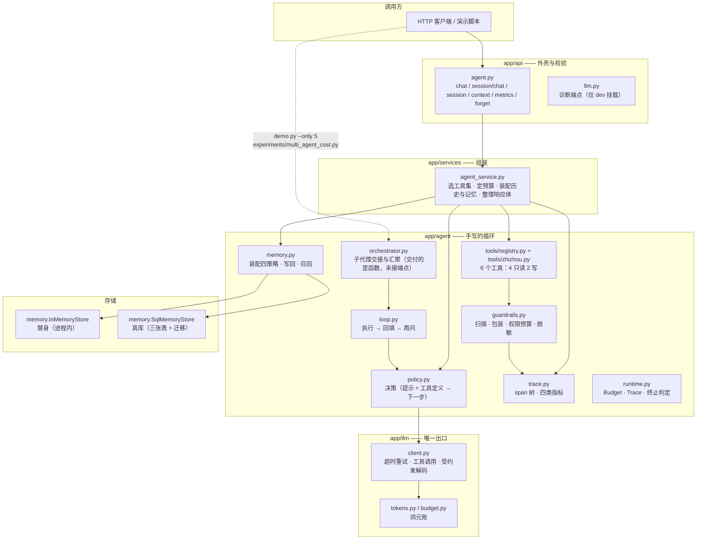
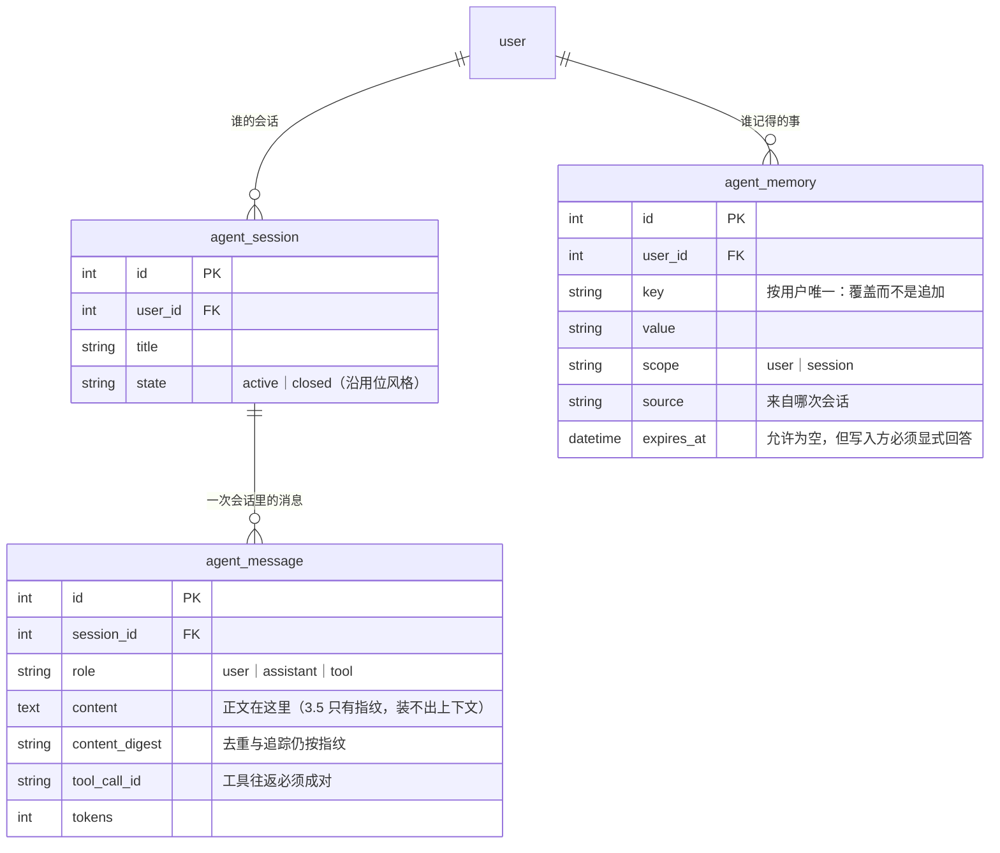

# 知舟 v3 架构图

> 这份图回答一个问题：**读者照着第 3 篇敲出来的东西，拼起来长什么样**。
> 它只画**已经存在的文件**（`zhizhou-v3/`），不画计划。
> 想看书里的讲解见第 3 篇 3.1–3.10 各章的「知舟接线」小节；验收标准见 [`PROJECT.md`](../../PROJECT.md)。

## 一、三条不变量

先记住这三条，图才有意义——它们是**单点入口**，绕过去就等于绕过了整篇的测试：

1. **一切模型调用走 `app/llm/client.py`**。其它模块不得直接发 HTTP。
2. **一切工具经 `app/agent/tools/registry.py`**。参数校验、权限档、幂等键、体积裁剪都在那一层。
3. **每一个步骤都写进 `app/agent/trace.py`**。指标是它的聚合，不是另算一遍。

## 二、分层



**这张图里最该看出的一件事**：`services/agent_service.py` 是唯一把零件拼起来的地方。
零件之间**不互相调用**——`loop` 不认识 `memory`，`registry` 不认识 `trace`，
`policy` 不认识 `tools`。所以每一段增量都能单独测（`tests/agent/` 下七个文件就是这么分的）。

### 哪些零件真接在服务上

**「写了」不等于「接上了」**，这两件事在这棵树里必须分开看：

| 零件 | 谁在调它 | 走一次 `/chat` 会经过它吗 |
| --- | --- | --- |
| `llm/client.py`、`tokens.py` | `policy`、`services` | ✅ |
| `agent/runtime.py`、`loop.py`、`policy.py` | `services` | ✅ |
| `tools/registry.py`、`tools/zhizhou.py` | `services` | ✅ |
| `agent/memory.py` | `services`（`/session/chat` 那条路） | ✅ |
| `agent/trace.py` | `services` ＋ 端点进程级一份 | ✅ |
| `agent/plan.py` | `api` 的 `/agent/plan` | ✅（只走那一个端点） |
| `agent/guardrails.py` | **`demo.py`、`experiments/`、测试** | ❌ — `/chat` 走的是未加护栏的 `bind_tools` |
| `agent/orchestrator.py` | `demo.py --only 5`、`experiments/multi_agent_cost.py` | ❌ — 交付的是函数，没有端点 |

后两行不是遗漏，是**顺序**：先把零件做到可测、可演示，再由需要它的人接上；
接的时候改的是装配层（`services/` 与 `api/`），零件一行不改——这正是 `guarded_bind`
做成与 `bind_tools` 同形的原因。而 3.10 的「组装」之所以要拿这张表说话，
是因为它是**唯一会把这些零件摆在一起看的地方**。

## 三、一次带记忆的请求

```mermaid
sequenceDiagram
    autonumber
    participant U as 调用方
    participant API as app/api/agent.py
    participant SVC as AgentService
    participant MEM as MemoryStore
    participant LOOP as loop + policy
    participant LLM as llm/client.py
    participant TR as trace.py

    U->>API: POST /api/v1/agent/session/chat
    API->>SVC: session_chat(task, session_id?)
    SVC->>MEM: ① 取历史快照（不含本轮）
    SVC->>MEM: ② 先把用户这一轮落库（写前日志）
    SVC->>MEM: ③ 召回长期记忆
    SVC->>SVC: 装配（full / clean / note / compress）
    SVC->>LOOP: run_agent(装配后的历史 + 本轮)
    loop 每一步
        LOOP->>TR: 开 span（chat / execute_tool）
        LOOP->>LLM: chat(messages, tools)
        LLM-->>LOOP: 工具调用或最终答案
        LOOP->>LOOP: 经注册表执行（校验 / 权限 / 幂等）
    end
    LOOP-->>SVC: LoopResult（终态 + 账 + 轨迹）
    SVC->>MEM: ④ 一次性回写轨迹与答案，并抽出偏好
    SVC-->>API: 响应体（含 memory 与 trace）
    API-->>U: Result{code, msg, data}
    U->>API: GET /api/v1/agent/metrics
    API->>TR: 读进程级的账
```

**顺序不是随便定的**：① 要在 ② 之前（否则本轮的提问会被算进「上一轮以前的历史」，
在装配里出现两次）；③ 在 ② 之后（本轮说的偏好也要被召回）；
④ 一次性写（半截轨迹落库会装出一个非法的请求——`tool` 消息必须紧跟声明同一个 id 的 `assistant`）。

## 四、七段增量各自加了什么

| 章 | 文件 | 端点 | 这一章真正的交付物 |
| --- | --- | --- | --- |
| 3.1 | `llm/tokens.py`、`llm/budget.py` | `POST /api/v1/llm/_budget`（仅 dev） | 词元账：钱花在哪一段提示上 |
| 3.2 | `llm/client.py`、`llm/prompts/article_summary.md`、`llm/schemas.py` | `POST /api/v1/article/{id}/summary` | 唯一模型出口：超时、重试、受约束解码 |
| 3.3 | `agent/runtime.py`、`agent/loop.py`、`api/agent.py` | `POST /api/v1/agent/chat` | 循环与**五类终止条件** |
| 3.4 | `agent/plan.py` | `POST /api/v1/agent/plan` | 计划是数据：动工具之前先校验 |
| 3.5 | `agent/tools/registry.py`、`agent/tools/zhizhou.py` | 复用 `/chat` | 6 个工具：参数防错、权限档、幂等键 |
| 3.6 | `models/agent.py`、`migrations/`、`agent/memory.py` | `GET /api/v1/agent/session/{id}` | 三张表 + 装配四策略 + 跨会话续跑 |
| 3.7 | `agent/orchestrator.py` | **无端点**：交付 `orchestrate()` 函数，由演示与实验调用 | 交接单四件、预算按份切、故障隔离、汇聚与缺口 |
| 3.8 | `agent/guardrails.py` | 复用 `/chat` | 扫描 · 包装 · 权限预算 · 脱敏 · 审计 |
| 3.9 | `agent/trace.py` | `GET /api/v1/agent/metrics` | span 树、四类指标、评测集与回归门 |
| 3.10 | `docs/architecture.md`、`tests/test_acceptance.py`、`scripts/acceptance.py` | 全部 | 组装：一键起服务 → 三条路径全通 |

## 五、三张表



## 六、旁路与主链路

差分清楚「挂了要修」和「挂了别拖垮主流程」——这是 3.9 那条「指标是旁路」的落地：

| 组件 | 挂了会怎样 | 因此的写法 |
| --- | --- | --- |
| `llm/client.py` | 请求失败，返回 `code=2` 与失败分类 | 有界超时 + 重试；`finish_reason=length` 单独报「输出被截断」 |
| `tools/registry.py` | 工具报错变成**一条观察**，不抛到循环外 | 坏参数、越权、幂等命中都记成结果 |
| `guardrails.py` | 硬拦截那一类直接拒；软提示交给模型 | 预筛在工具执行**之前**，被拒的工具在 `executed` 里不留痕；**它只在演示与实验里接上** |
| `trace.py` | **不该影响主流程** | `Price.from_env` 配错就降级成「没有单价」，不抛异常 |
| `memory.SqlMemoryStore` | 会话装不出来，报 404 或 500 | 替身与真库同接口，装配层一行不改 |

## 七、刻意不做的（与后面几篇的分界）

- **不引 Agent 框架**：第 4 篇用 LangChain / LangGraph 重写同一件事，然后对照。
- **不做检索**：只「查自己的数据库」（3.5），文档解析与向量库在第 5 篇。
- **不做网关与路由**：只记账（3.1 的预算、3.9 的指标），第 6 篇做路由、降级与计费。
- **不做部署与前端**：只保证本机能起（`uvicorn app.main:app`），容器与 SSE 界面在第 8 篇。
