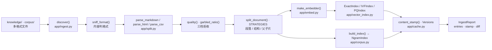
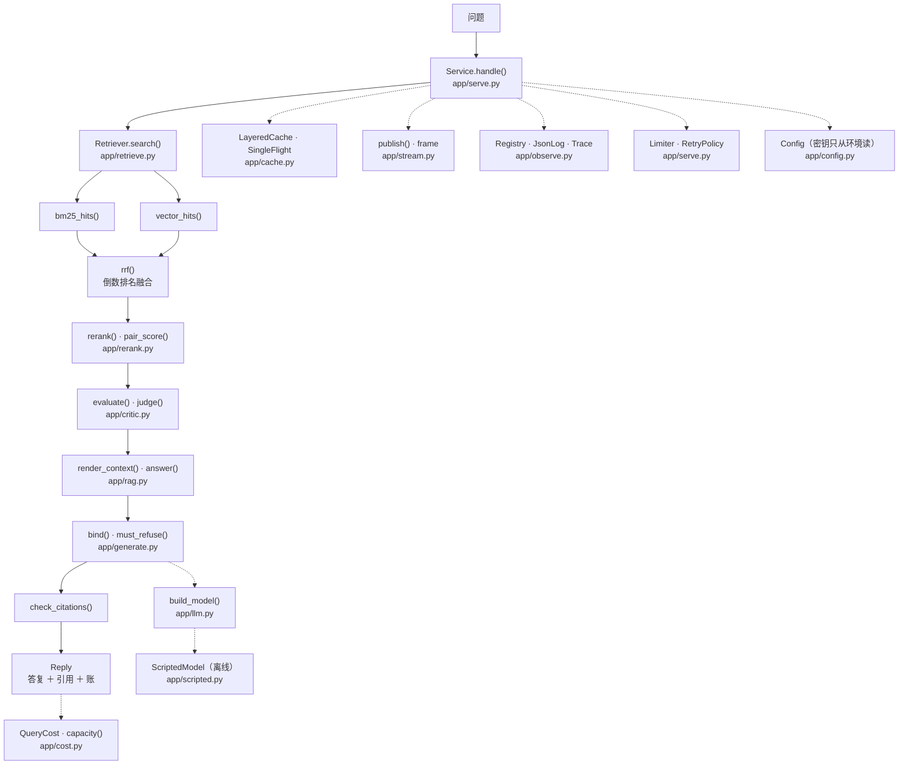

# 知舟 v5 架构：请求从哪进、数据从哪来、每一步留下什么

这份文档回答三个问题，每个问题都有对应的图或表：

1. **请求从哪进** → 图二（在线问答）顶端的那个入口；
2. **数据从哪来** → 图一（离线入库）左边的目录，以及它右侧落盘的那三样东西；
3. **每一步留下什么产物** → 两张图上每个节点的产物，以及对照表最后一列。

它由 `scripts/recap.py` 逐条核对：**文档点名的每个模块都必须存在**、**树里每个模块都必须被点名**、
**每条 ADR 引用的读数都必须在 `experiments/eval_baseline.json` 里找得到**、
**标了「N 行」的文件必须真的有那么多行**、
**写下的「N 条夹具」与「N 条用例」必须与实得相等**（两个数都是**跑出来的**：夹具数在进程内数，
用例数是**导入那个测试模块、数它真的有几个 `test_` 函数**——与树内自检同一把尺子）。
对不上就非零退出——手写的第二份清单必须自己对账（`STYLE` 8.8 第 7 条）。

## 一条纪律：图上不出现「没有模块的节点」

画架构图最容易犯的错是**画愿望**：图上写「向量检索服务」「缓存层」「可观测平台」，
而树里并没有对应的文件。这条纪律把它变成可判定的：**每个节点都必须能指到一个真实模块**，
指不到就不画进图里（`recap.py` 核到模块这一级；函数名漂了要人看，这是一处已知边界）。

## 图一：离线入库（一次运行，产物落盘）



这张图上有两个**容易画错**的地方，都不是排版问题：

- **两个 `build_index()`**。`app/split.py` 的 `build_index()` 收文档、出片（切分那一侧）；
  `app/corpus.py` 的 `build_index()` 收语料、出 `NgramIndex`（索引那一侧）。
  名字撞车而职责不同——图上因此不写裸的 `build_index()`，而是把它的产物写出来
  （`NgramIndex` 那一格）。**函数名撞车时，用产物认人。**
- **两路索引是并列的，不是串联的。** 片同时喂给向量索引（`app/vector_index.py`）
  与字面索引（`app/corpus.py` 的 `NgramIndex`），而在线侧**两路并集**才进融合。
  画成串联会让人以为字面路是向量路的兜底——那不是本树的设计（见 ADR-0001）。

## 图二：在线问答（每次请求重走一遍）



实线是**请求路径**（一次请求必然经过），虚线是**旁路**（缓存、日志、限流、账、配置）——
旁路失败不该改变答复本身，只该让这一笔账不完整。这条区分也是画图时的判据：
**「它失败时答不答得出话」决定它画实线还是虚线。**

## 图外：读数与验收（不在请求路径上）

有三个模块**刻意不进这两张图**，因为它们不是「系统在跑」的一部分，而是「事后的一次运行」：

| 模块 | 什么时机跑 | 谁在用 |
| --- | --- | --- |
| `app/metrics.py` | 评测与验收时（题集在 `tests/rag/eval_cases.jsonl`，24 条） | `experiments/eval_run.py`、`scripts/acceptance.py` |
| `app/questions.py` | 每一章的阅读器脚本（它提供 5.1 的 Q1–Q4：两类「答不了」的种子） | `scripts/why_rag.py` 等五个阅读器、`tests/test_why_rag.py` |
| `scripts/recap.py` | 改完文档时 | 提交门（`tools/check_runnable.py` 的离线入口） |

把它们画进请求路径会得到一个**看着更完整、实际更假**的图：Q1–Q4 是演示与实验的入口，
`metrics` 是**事后**的裁判，`recap` 是文档这一侧的对账——三者的共同点是
**不在一次请求里发生**。

## 节点 → 模块对照表

| 模块 | 在哪张图 | 产物或职责 | 谁调它 |
| --- | --- | --- | --- |
| `app/ingest.py` | 图一 | `IngestReport`（逐行处置 ＋ 语料戳 ＋ 差量） | `scripts/acceptance.py` |
| `app/split.py` | 图一 | 格式判定、四条解析路、三档质量门、切分策略 | `app/ingest.py` |
| `app/embed.py` | 图一 | 向量（`HashedEmbedder`，256 维） | `app/retrieve.py`、图一的入库 |
| `app/vector_index.py` | 图一 | `ExactIndex`／`IVFIndex`／`PQIndex` 三种索引 | `app/retrieve.py` |
| `app/corpus.py` | 图一 | `NgramIndex`（字面路）与 `load_corpus()` | `app/retrieve.py` |
| `app/cache.py` | 图一、图二 | 内容戳 `content_stamp()`、`Versions`、三层缓存、`SingleFlight` | 入库与 `app/serve.py` |
| `app/serve.py` | 图二 | `Service.handle()`：限流、会话、重试、答复 | 阅读器脚本与 `scripts/acceptance.py` |
| `app/retrieve.py` | 图二 | 两路检索 ＋ `rrf()` 融合 ＋ 查询改写 | `app/serve.py` |
| `app/rerank.py` | 图二 | 成对打分与候选深度扫描 | `app/serve.py` |
| `app/critic.py` | 图二 | 置信度三档与知识精炼 | `app/serve.py` |
| `app/rag.py` | 图二 | 上下文渲染、`answer()`、`check_citations()` | `app/serve.py` |
| `app/generate.py` | 图二 | 按句绑定与三条拒答判据 | `app/serve.py` |
| `app/stream.py` | 图二 | 事件帧与按号补发 | `app/serve.py` |
| `app/observe.py` | 图二 | 指标注册表、结构化日志、追踪 | `app/serve.py` |
| `app/llm.py` | 图二 | 真实模型客户端（超时与重试） | `app/serve.py`、评测 |
| `app/scripted.py` | 图二 | 离线用的剧本模型 | 全部离线入口 |
| `app/config.py` | 图二 | 配置与密钥（只从环境读） | 全部模块 |
| `app/cost.py` | 图二（旁路） | 每次问答的账与容量估算 | 读数脚本 |
| `app/metrics.py` | 图外 | 判据与指标（片级、答案命中、拒答四格、分辨率） | 评测与验收 |
| `app/questions.py` | 图外 | 24 条评测题 | 评测与验收 |

## 交付物清单：谁几行

5.9 加进树里的文件逐个列在下面。**「行数」这一格是第四条对账的对象**：
改了一行而这一格没跟着改，`--check` 就红，并把真实行数报出来（修法是把新数抄进去，
**不是把这一格删掉**——删了就等于把它退回没人核的状态）：

| 文件 | 行数 | 里面是什么 |
| --- | ---: | --- |
| `docs/decisions/0001-两路并行-不引外部向量库.md` | 20 行 | ADR-0001：为什么保留两路，而不引外部向量库 |
| `docs/decisions/0002-门只收片级判据.md` | 17 行 | ADR-0002：门建在片级上，文档级只作粗筛 |
| `docs/decisions/0003-拒答走可判定条件.md` | 18 行 | ADR-0003：拒答不是调阈值能解决的 |
| `docs/decisions/0004-按句绑定-答复过代码核对.md` | 17 行 | ADR-0004：引用精确到句，答复过代码核对 |
| `docs/decisions/0005-换切法不擅自迁移.md` | 19 行 | ADR-0005：迁移会作废七章的读数，要人拍板 |
| `docs/decisions/0006-账按笔记.md` | 20 行 | ADR-0006：账按「笔」记，单位是提示词汉字数 |
| `scripts/recap.py` | 557 行 | 五条对账 ＋ **28 条夹具**；`--check` 与 `--offline` 同义 |
| `tests/test_recap.py` | 191 行 | **6 条用例**，其中四条用第二种实现与对账脚本互相对照 |

**这一份文档自己不写在这一表里**：它写自己的行数，就会「改一个字要改两个数」——
而那属于噪声不属于信号。表里每一格都是**有人真要核的断言**，自指的那一格不是。

## 这份文档怎么被核对

```bash
cd zhizhou-v5
python scripts/recap.py --check      # 五条：模块双向点名、ADR 字段、读数引用、行数标注、自描述条数
python scripts/recap.py --self-test  # 28 条夹具（含「删一个模块名就红」「改一行就红」）
python tests/test_recap.py           # 6 条用例
```

五条核对各自对应一种**不会报错**的漂移：

1. **文档点了不存在的模块**——读者照着找，找不到（读文档的人不会来问你）；
2. **树里长了新模块而文档没点名**——图从「现状」退化成一个没标日期的快照；
3. **ADR 引用的读数与实跑不符**——那条「当时手上的数」变成回忆，而回忆会被后来的读数悄悄推翻；
4. **标的行数与盘上不符**——「这个文件大约三百行」这类断言最像真的，因此最难被发现；
5. **写下的夹具/用例条数与实得不同**——它们只在改脚本时才该变，而改脚本的人往往
   不觉得「文档里那个数」跟自己有关。接上这条的当天，就在这里抓到一处**八条夹具**
   （而脚本当时已经有 10 条）——那个数字在文档里躺了很久，而三道检查都不看它。

这五条的约定是同一个：**阿拉伯数字就是断言，引用旧数字写成汉字**（「八条夹具」）。
没有这条出口，写历史的人就只有两个选择：把旧数字改成好看的样子，或者把检查关掉。

## 已知不足（本树没有的）

写在这里而不是留给人去发现：

- **没有真实并发用户**。`Service` 有并发闸门与排队上限，但全部读数都在单进程离线跑出来；
  真实流量下的排队分布、超时分布、缓存命中率**一条都没量过**；
- **没有多租户**。语料前缀（`knowledge.`）能区分来源，但两套库不能各带各的权限一起住；
- **没有向量库**（见 ADR-0001）。理由是语料规模，**不是**「自研更好」——
  超过约定规模时这条决定就该被推翻，推翻的条件写在 ADR 的失效线里。
